# Work Summary: Sep 6th

## Define Consensus Partition

### Review: Temporal Community Detection

$$ Q = \sum_{i\neq j} [A_{ij} - \frac{k_ik_j}{2m}]\delta(C_i,C_j)$$

$C_i$: The community that node $i$ belongs to.

$A_{ij}$: The magnitude squared spectral coherence between node $i$ and node $j$.

$k_i = \sum_{j\neq i} A_{ij}$ : The total degree of node $i$.

$m = \frac{1}{2}\sum_{i\neq j} A_{ij}$ : The total edge weight in the network.

#### Temporal Community Detection

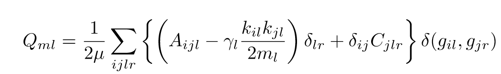

Parameters: $\gamma_l = 1, C_{jlr} = 1$

- Greater $\gamma_l$ leads to more communities
- Greater $C_{jlr}$ leads to a stronger correlation in partition results between consecutive time steps

#### Visualize the Temporal Partition of a Single Trial

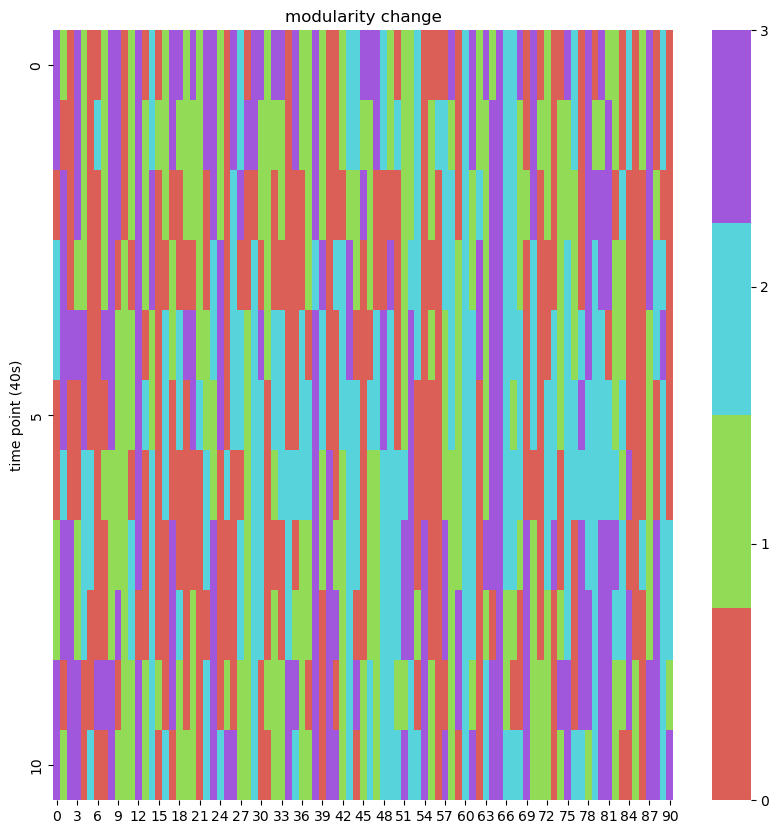

### Questions

- "Align" different trials
- Find patterns/structures in temporal partitions
- Find appropriate statistics to reveal the properties of nodes

## Find patterns in partitions

### Consensus Partition

#### References

 Braun, U. et al. Dynamic reconfiguration of frontal brain networks during executive cognition in humans. Proc. Natl. Acad. Sci. U.S.A. 112, 11678–11683 (2015).

#### Modular Allegiance Matrix $T$

For each partition, $\forall i,j \in \{1,2,\cdots,91\}$

$$T_{ij}(t) = \delta(C_i(t),C_j(t))$$

$C_i(t)$: The community that node $i$ belongs to at time window $t$.

$${T}_{cons} = \langle {T}(t) \rangle$$

$T_{cons}(i,j)$ corresponds to the probability that node $i$ and node $j$ belong to the same community.

#### Apply the Community Detection Algorithm to $T_{cons}$

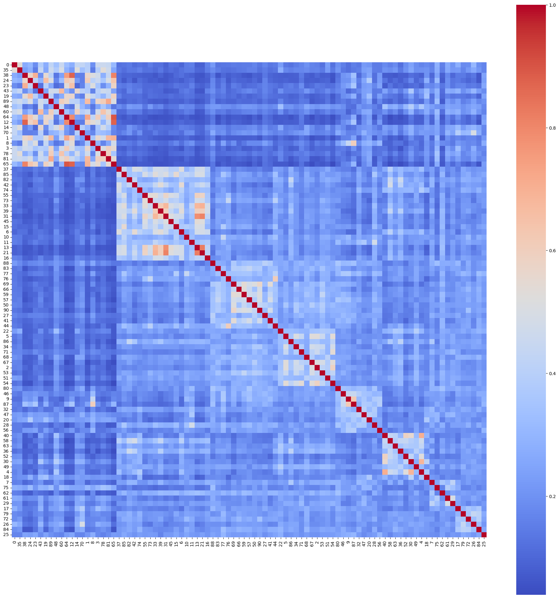

#### Visualize the Consensus Partition

[Consensus Partition](https://scalablebrainatlas.incf.org/services/view3d_l2v.php?template=MERetal14_on_F99&space=F99&mesh=ctxL&deform=inflated&l2v=%7B%22SUB%22%3A+0%2C+%22TEOm%22%3A+0%2C+%2213%22%3A+3%2C+%22TEpd%22%3A+0%2C+%22LB%22%3A+5%2C+%2211%22%3A+3%2C+%227B%22%3A+1%2C+%22F5%22%3A+6%2C+%22V3A%22%3A+0%2C+%22V6A%22%3A+4%2C+%2231%22%3A+1%2C+%22VIP%22%3A+1%2C+%22V3%22%3A+0%2C+%22F1%22%3A+1%2C+%22STPi%22%3A+0%2C+%2223%22%3A+1%2C+%22AIP%22%3A+1%2C+%22TEpv%22%3A+7%2C+%22SII%22%3A+5%2C+%22V4t%22%3A+0%2C+%22MST%22%3A+4%2C+%223%22%3A+1%2C+%22TEav%22%3A+3%2C+%22V1%22%3A+0%2C+%22MT%22%3A+0%2C+%22ProSt%22%3A+8%2C+%22PERI%22%3A+7%2C+%229-46v%22%3A+2%2C+%22MIP%22%3A+4%2C+%2244%22%3A+6%2C+%22PBc%22%3A+5%2C+%221%22%3A+1%2C+%227A%22%3A+4%2C+%225%22%3A+1%2C+%2210%22%3A+3%2C+%22TEam-a%22%3A+0%2C+%22OPRO%22%3A+5%2C+%227op%22%3A+1%2C+%22V2%22%3A+0%2C+%222%22%3A+1%2C+%22Core%22%3A+5%2C+%229-46d%22%3A+2%2C+%22ProM%22%3A+1%2C+%22STPc%22%3A+0%2C+%2224a%22%3A+2%2C+%22F2%22%3A+1%2C+%22DP%22%3A+4%2C+%22LIP%22%3A+4%2C+%22PBr%22%3A+0%2C+%22PIR%22%3A+5%2C+%2246v%22%3A+2%2C+%22OPAI%22%3A+3%2C+%22MB%22%3A+5%2C+%2232%22%3A+3%2C+%2212%22%3A+3%2C+%22F3%22%3A+1%2C+%22V6%22%3A+4%2C+%228B%22%3A+2%2C+%22INS%22%3A+5%2C+%2224c%22%3A+2%2C+%22PGa%22%3A+0%2C+%2245B%22%3A+6%2C+%22F4%22%3A+6%2C+%22Pi%22%3A+5%2C+%22TEO%22%3A+0%2C+%22V4%22%3A+0%2C+%22F6%22%3A+2%2C+%2214%22%3A+3%2C+%2225%22%3A+3%2C+%2246d%22%3A+2%2C+%22TEad%22%3A+0%2C+%2245A%22%3A+3%2C+%22STPr%22%3A+7%2C+%2224d%22%3A+1%2C+%22TPt%22%3A+1%2C+%228l%22%3A+6%2C+%2224b%22%3A+2%2C+%2229-30%22%3A+2%2C+%22IPa%22%3A+0%2C+%22ENTO%22%3A+7%2C+%228m%22%3A+4%2C+%22TEam-p%22%3A+0%2C+%22Gu%22%3A+1%2C+%22F7%22%3A+2%2C+%22TH-TF%22%3A+7%2C+%227m%22%3A+1%2C+%22POLE%22%3A+3%2C+%22PIP%22%3A+4%2C+%228r%22%3A+2%2C+%22FST%22%3A+0%2C+%229%22%3A+2%7D&clim=%5B-2%2C8%5D&bg=%5B1000%2C1000%2C1000%5D&width=800&height=800&cam=L&overlay=values&format=xhtml "Consensus Partition")

#### Properties of the Consensus Partition

- The number of communities: 9
  - greater than the number of communities in each trial

- Stability (measured by normalized mutual information (NMI))
  - Stable across different random seeds
  - Across subjects?

- Strong spatial coherence

#### Unsuccessful Attempt

- Classify the temporal partitions using the modular allegiance matrix $T$

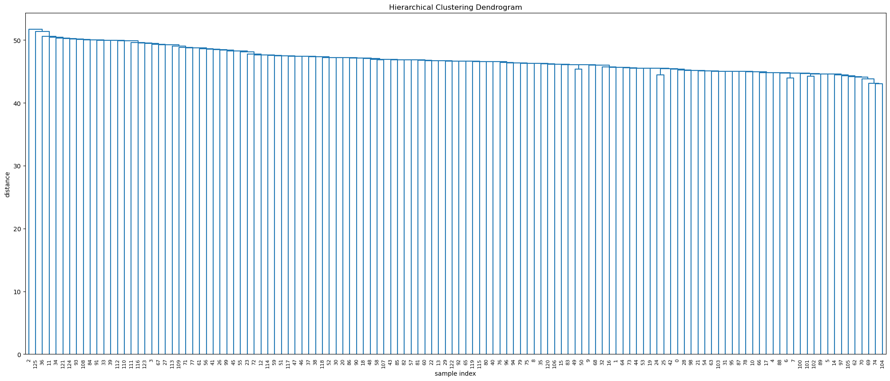

### Using the Consensus Partition to Find Patterns in Temporal Partitions

#### Initial Idea (Hypothesis)

- Temporal communities are the combinations of communities in the consensus partition
- In each period, there is one prominent temporal community (strong cohesion) and several minor communities (weak cohesion)

#### Calculate the "Similarity" Between Temporal and Consensus Communities

The consensus partition: $\{C^1,C^2,\cdots,C^n\}$ ($n=9$)

The temporal partition: $\{C^1(t),C^2(t),\cdots,C^m(t)\}$

$$P_{ij}(t) = \frac{|C^i(t) \cap C^j|}{|C^j|}$$

$P_{ij}(t)$: The proportion of nodes in consensus community $C^j$ that belong to temporal community $C^i(t)$

#### Visualize the "Similarity" Matrix in a Single Trial

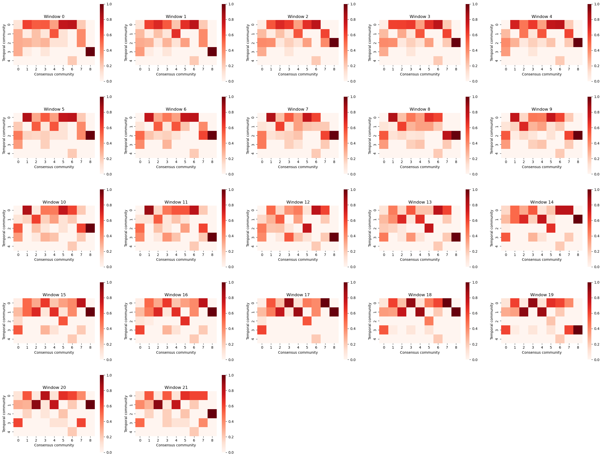

- Joining and splitting of communities?

#### Find Temporal Communitiy Patterns Using Hierarchical Clustering

Use a vector to represent each temporal community:

$$\vec{P_i}(t) = [P_{i1}(t),P_{i2}(t),\cdots,P_{in}(t)]$$

Perform hierarchical clustering on $\vec{P_i}(t)$ (regardless of time windows or trials)

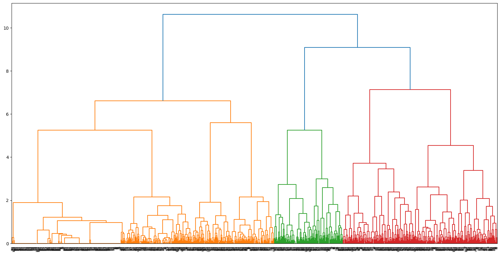

- **Stability?**
- **Relationship with trials?**

#### Visualize the Temporal Community Patterns

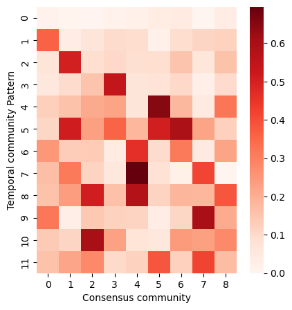

- For some consensus communities, there is a "single" state and several "multiple" states
  - Visual
  - Sensory-Motor

#### Another Way of Finding Temporal Community Patterns

Each temporal community is represented a vector of length 91 (the number of nodes):

$$ M_i(t) = [m_{i1}(t),m_{i2}(t),\cdots,m_{i91}(t)]$$

$m_{ij}(t) = 1$ if node $j$ belongs to temporal community $C^i(t)$ at time $t$, otherwise $m_{ij}(t) = 0$

Perform hierarchical clustering on $M_i(t)$ (regardless of time windows or trials):

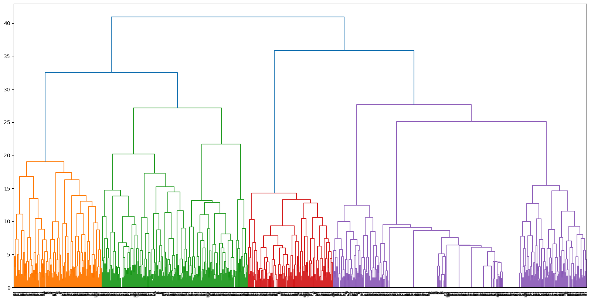
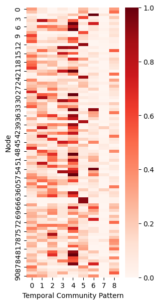

(Each temporal community pattern here is the mean value of a cluster, each element of the vector is the probability that a node belongs to the temporal community)

##### Mapping the Temporal Community Patterns to the Consensus Communities

## Explore the Statistics

### Main Reference

Garcia, J. O., Ashourvan, A., Muldoon, S., Vettel, J. M. & Bassett, D. S. Applications of Community Detection Techniques to Brain Graphs: Algorithmic Considerations and Implications for Neural Function. Proc. IEEE 106, 846–867 (2018).

### Within-and Between-Module Connectivity

$$I_{ij} = \frac{\sum_{i\in C_i}\sum_{j\in C_j}A_{ij}}{N_iN_j}$$

$A_{ij}$: The coherence between node $i$ and node $j$.

$C_i$: The set of nodes in community $i$.

$N_i$: The number of nodes in community $i$.

#### Relative Interaction Strength

$$R_{ij} = \frac{I_{ij}}{\sqrt{I_{ii}I_{jj}}}$$

Relative interaction strength among consensus communities (calculated from pearson correlation):

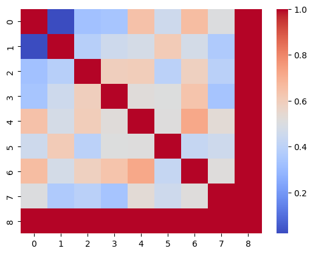

- Decoupling of visual and sensory-motor systems

### Intra & Inter Modular Strength z-Score

$$S_{iC_k} = \sum_{j\in C_k}A_{ij}$$

$$z_{iC_k} = \frac{S_{iC_k}-\mu_{iC_k}}{\sigma_{iC_k}}$$

$\mu_{iC_k}$: The mean of $S_{iC_k}$ across all nodes in community $C_k$.

$\sigma_{iC_k}$: The standard deviation of $S_{iC_k}$ across all nodes in community $C_k$.

### Participation Coefficient

$$P_i = 1- \sum_{k=1}^{n}(\frac{S_{iC_k}}{S_{i}})^2$$

In which:

$n$ is the number of consensus communities

$S_{iC_k} = \sum_{j\in C_k}A_{ij}$

$S_i = \sum_{j}A_{ij}$

### Flexibility of Nodes (The Probability of Changing Community Membership Across Time Windows)

$$F_i = \frac{1}{T-1}\sum_{t=1}^{T-1}\delta(C_i(t),C_i(t+1))$$

$T$: The number of time windows

$C_i(t)$: The community that node $i$ belongs to at time window $t$.

### Coverage of Nodes

$\Phi_i $ is the proportion of communities that node $i$ once belonged to.

#### A Toy Model to Link Flexibility and Participation Coefficient

Suppose the probability for a node $i$ belonging to community $C_k$ is $\frac{S_{iC_k}}{S_i}$. Then the probability for not switching community membership is 

$$\sum_k (\frac{S_{iC_k}}{S_i})^2$$

Therefore, the probability for switching community membership is

$$F_{switch} = 1-\sum_k (\frac{S_{iC_k}}{S_i})^2 = P$$

The probablility distribution of coverage can be derived from this model (a bit complex)

#### The Relationships between the Statistics

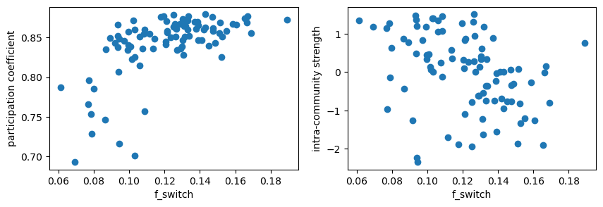

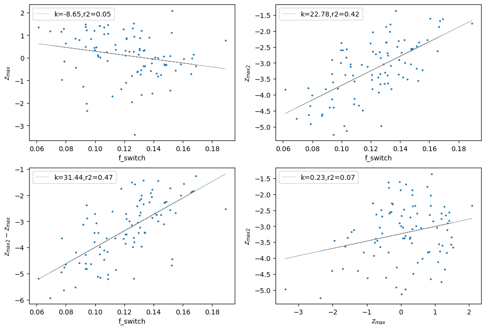

## Future Plans

### Statistical Tests

- Stability of the consensus partition (trials, subjects)
- Deciding the threshold for the statistics
  - Threshold for magnitude-squared coherence
  - Threshold for modular allegiance matrix $T_{cons}$
  - P-value for the statistics (z-score, participation coefficient, flexibility, coverage)
    - Is there a distinct difference between two nodes?
- The effectiveness of temporal community patterns
  - Define temporal community patterns for each subject
  - Is clustering reasonable?
  - The variation across trials and subjects

### Explorations

- Properties of each consensus community
  - Merging and splitting of communities
- The relationships among statistics
- The relationship between functional and structural connectivity
